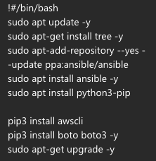
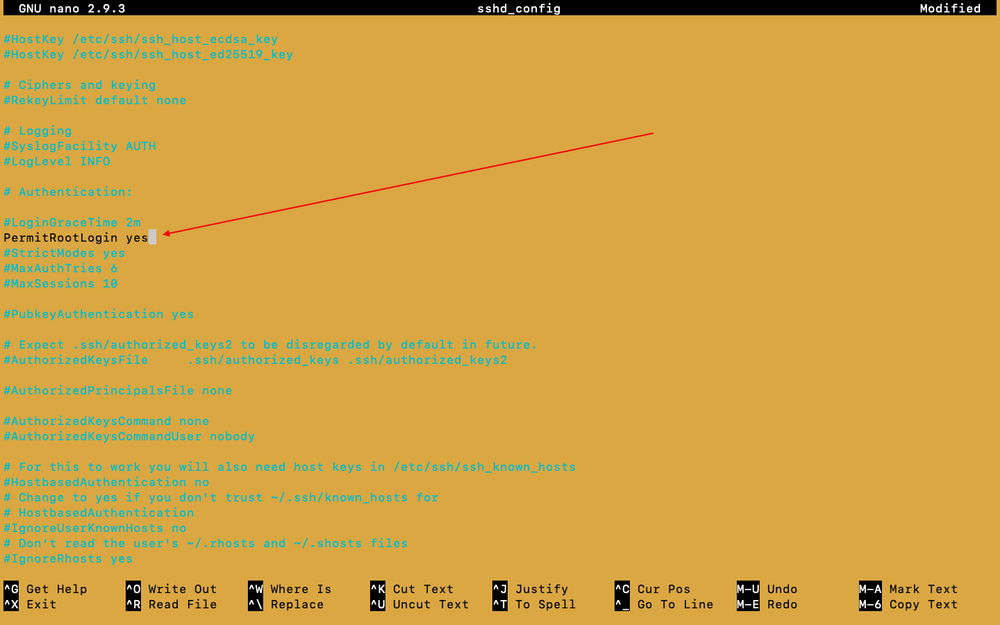
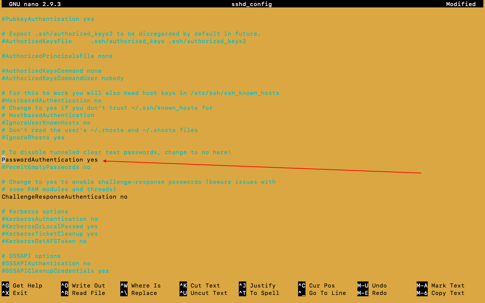

# Terraform

## install terraform
- navigate to folder created (terraform)
- brew tap hashicorp/tap
- brew install hashicorp/tap/terraform
- if error comes follow steps in error message and re-run script
### secure AWS keys
- edit the .bashrc file
- export AWS_ACCESS_KEY_ID="xxxxxxxxxxxxxxxxxxxxxxxxxx"
- export AWS_SECRET_ACCESS_KEY="xxxxxxxxxxxxxx"
- source ~/.bashrc
#### create folder structure

- create 'main.tf'
- only newly added instructions will be executed everytime, is capable of destroying resources and restarting if needed

##### Run a terraform
- terraform init
- terraform plan
- terraform apply
- how to destroy?

##### ssh into machine created
-   ssh -i "~/.ssh/eng99.pem" ubuntu@ec2-34-255-161-170.eu-west-1.compute.amazonaws.com

### Creating Variable
- create a file called "variable.tf"
- 
- to call the variable use command var.VARIABLE_NAME
- add file to .gitignore for security purposes(eg. type of machine being used is not exposed  )
##### create a vpc using terraform
- https://registry.terraform.io/modules/terraform-aws-modules/vpc/aws/latest

-       module "vpc" {
  source = "terraform-aws-modules/vpc/aws"

  name = "eng99_vigneshraj_terraform"
  cidr = "10.0.0.0/16"

  azs             = ["eu-west-1a", "eu-west-1b", "eu-west-1c"]
  private_subnets = ["10.0.1.0/24", "10.0.2.0/24", "10.0.3.0/24"]
  public_subnets  = ["10.0.101.0/24", "10.0.102.0/24", "10.0.103.0/24"]

  enable_nat_gateway = false
  enable_vpn_gateway = false

  tags = {
    Terraform = "true"
    Environment = "dev"
  }
}
##### create security group using terraform
- Inbound and outbound Rules have to be specified explictly
- any changes can be made in the future
- inbound rules are called ingress
- allow port 3000 for tcp from anywhere
- allow port 22 for tcp from any where
- outbound rules are called egress

##### create EC2 using terraform

# Day 4:

## Secure keys using Ansible Vault (password:1234)
- ssh into contoller (vagrant ssh contoller)
- we need the eng99.pem to ssh to aws ec2
- install python 3
  -     sudo apt install python3-pip
  -     alias python=python3
- check with command:
  -     python3 --version
  -     python --version
- install aws CLI
  -     pip3 install awscli
-     pip3 install boto boto3
-     sudo apt-get upgrade -y

- edit the host file

- cd to home
- cd .ssh
- sudo nano eng99.pem (copy from our local host)
- sudo chmod 400 eng99.pem
- ssh into aws from contoller if sucess then we continue
- naviagte to /etc/ansible
- sudo mkdir group_vars
- cd group_vars
- sudo mkdir all
- cd all
- sudo ansible-vault create pass.yml (this will take us inot vim)
  - we will be promted to create a password(1234)
  - aws_access_key: xxxxxxxxxx
  - aws_secret_key: xxxxxxxxxx
  - press esc 
  - type out ":wq!" and press enter to exit
  
  - sudo ansible-vault edit pass.yml
  - shift +zz to quit whne in edit mode

- ssh into app
  - cd etc
  - cd ssh  (not .ssh)
  - sudo nano sshd_config (make 2 changes)
    - 2 image to show 2 changes
      
      

    - sudo systemctl restart ssh
    - sudo systemctl enable ssh
  - got to aws consol
    - get public ip of instance to enter in hosts file

- ssh into contoller
  - nagigate to /etc/ansible
  - sudo nano hosts
    
  - sudo ansible aws -m ping --ask-vault-pass
  - should ping and give sucess statment(ping: pong)
    - sudo ansible aws -m ping --ask-vault-pass
# Run playbooks on AWS Resources from ansible contoller
- ssh into contoller
  - naviagte to /etc/ansible
  - edit the playbook to "host: aws"
  - run playbook:
    - sudo ansible-playbook --ask-vault-pass install_nginx.yml

