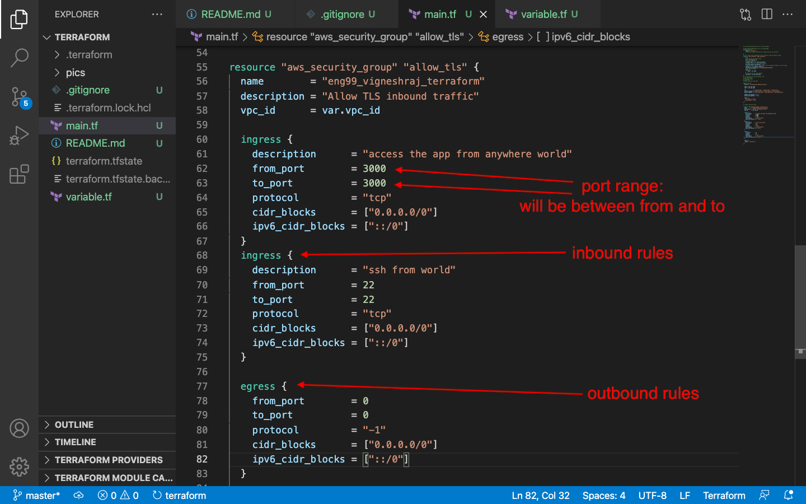

# Terraform

## install terraform
- navigate to folder created (terraform)
- brew tap hashicorp/tap
- brew install hashicorp/tap/terraform
- if error comes follow steps in error message and re-run script
### secure AWS keys
- edit the .bashrc file
- export AWS_ACCESS_KEY_ID="xxxxxxxxxxxxxxxxxxxxxxxxxx"
- export AWS_SECRET_ACCESS_KEY="xxxxxxxxxxxxxx"
- source ~/.bashrc
#### create folder structure

- create 'main.tf'
- only newly added instructions will be executed everytime, is capable of destroying resources and restarting if needed

##### Run a terraform
- terraform init
- terraform plan
- terraform apply
- how to destroy?

##### ssh into machine created
-   ssh -i "~/.ssh/eng99.pem" ubuntu@ec2-34-255-161-170.eu-west-1.compute.amazonaws.com

# Creating Variable
- create a file called "variable.tf"
- 
- to call the variable use command var.VARIABLE_NAME
- add file to .gitignore for security purposes(eg. type of machine being used  )
##### create a vpc using terraform
- https://registry.terraform.io/modules/terraform-aws-modules/vpc/aws/latest

-       module "vpc" {
  source = "terraform-aws-modules/vpc/aws"

  name = "eng99_vigneshraj_terraform"
  cidr = "10.0.0.0/16"

  azs             = ["eu-west-1a", "eu-west-1b", "eu-west-1c"]
  private_subnets = ["10.0.1.0/24", "10.0.2.0/24", "10.0.3.0/24"]
  public_subnets  = ["10.0.101.0/24", "10.0.102.0/24", "10.0.103.0/24"]

  enable_nat_gateway = false
  enable_vpn_gateway = false

  tags = {
    Terraform = "true"
    Environment = "dev"
  }
}
##### create security group using terraform
- Inbound and outbound Rules have to be specified explictly
- any changes can be made in the future

##### create EC2 using terraform

